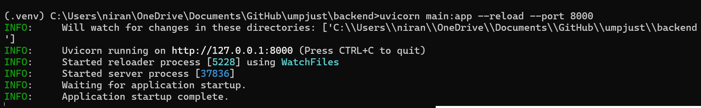
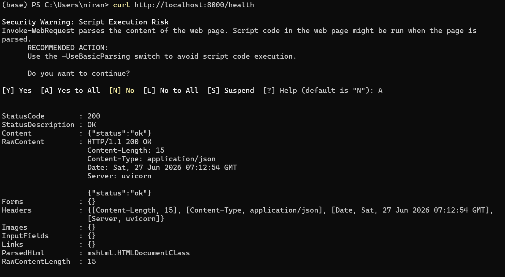

# ラボAIナレッジエージェント — バックエンド

アップロードされたラボの資料をもとに質問に答えるAIアシスタントです（Amazon Bedrock上のRAG）。答えがわからない場合は正直にそう伝え、教授が後で確認できるよう質問を記録します — でたらめな回答はしません。

---

## フロントエンドチームへ

Pythonのコードは読まなくて大丈夫です！サーバーをローカルで起動（下記手順）して、APIを呼び出すだけでOKです。APIの仕様は [API.ja.md](API.ja.md) にまとめてあります。

ベースURL: `http://localhost:8000`  
リクエスト・レスポンスはすべてJSON形式です。  
インタラクティブなAPIドキュメント（自動生成）: [http://localhost:8000/docs](http://localhost:8000/docs)

---

## セットアップ（Windows）

### 1. Pythonがインストールされているか確認
```powershell
python --version
# 3.10以上であること
```

### 2. バックエンドフォルダに移動し、仮想環境を有効化
```powershell
cd C:\path\to\umpjust\backend
.venv\Scripts\activate.bat
```

`.venv` がまだない場合は、先に作成してください：
```powershell
python -m venv .venv
.venv\Scripts\activate.bat
pip install -r requirements.txt
```

### 3. AWSクレデンシャルを設定
一度だけ実行すれば、以降はboto3が自動で読み込みます。
```powershell
aws configure
# AWS Access Key ID:     <キーを入力>
# AWS Secret Access Key: <シークレットを入力>
# Default region name:   us-east-1     <-- 必ずus-east-1（東京ではない）
# Default output format: json
```

### 4. サーバーを起動
```powershell
uvicorn main:app --reload --port 8000
```



### 5. 動作確認
```powershell
curl http://localhost:8000/health
```



`{"status":"ok"}` が返ってきたら成功です。

AWSなしで決定的なデモを行う場合：

```powershell
.\scripts\run-demo.ps1
```

ハッカソン中だけHTTPSで公開する場合は、フロントエンドの正確な
オリジンを指定して起動します：

```powershell
winget install --id Cloudflare.cloudflared --exact
.\scripts\start-public-demo.ps1 -Mode demo -FrontendOrigin https://your-frontend.example
```

フロントエンドは画面に表示された `X-Demo-Token` を送信する必要が
あります。終了後は `Ctrl+C` で必ず停止してください。セキュリティ上の
制約は [docs/HOSTING.md](docs/HOSTING.md) を参照してください。

発表用の英語・日本語、ライト・ダーク両テーマの図は
`.\scripts\render-presentation-charts.ps1` で生成できます。

---

## APIエンドポイント一覧

### `POST /ask` — AIに質問する

メインのエンドポイントです。質問を送ると、回答と出典が返ってきます。

**リクエスト:**
```json
{
  "message": "輝度つまみはどこですか？",
  "session_id": "session_123",
  "current_state": { "active_figure_id": "panel_01" }
}
```

| フィールド | 必須 | 説明 |
|-----------|------|------|
| `message` | はい | 質問文（日本語推奨） |
| `session_id` | いいえ | セッションを識別する任意の文字列 |
| `current_state.active_figure_id` | いいえ | ユーザーが見ている図のID（デフォルト: `panel_01`） |

**レスポンス（回答あり）:**
```json
{
  "answer_text": "照射系を調整するには、パネル右上の輝度つまみを時計回りに回します。",
  "next_step_hint": "次に、対物レンズのフォーカスを確認してください。",
  "visual_data": { "figure_id": "panel_01", "highlight_item": "輝度つまみ" },
  "citations": [
    { "source": "顕微鏡マニュアル.pdf", "snippet": "輝度つまみはパネル右上にあり…" }
  ],
  "confidence": 0.82,
  "is_gap": false
}
```

**レスポンス（回答なし — ナレッジギャップ）:**
```json
{
  "answer_text": "ご質問の内容は、まだ研究室の資料に記録されていないようです。この質問は記録しましたので、先生が後で確認できます。",
  "next_step_hint": null,
  "visual_data": { "figure_id": "panel_01", "highlight_item": null },
  "citations": [],
  "confidence": 0.0,
  "is_gap": true
}
```

| レスポンスフィールド | 説明 |
|-------------------|------|
| `answer_text` | 回答文。資料に記録がない場合は正直な「わかりません」メッセージ |
| `visual_data.highlight_item` | 図上でハイライトするホットスポット名（なければ `null`） |
| `visual_data.image_url` | 検索されたPDFページのJPEG data URL（なければ `null`） |
| `visual_data.source` / `page_number` | 出典PDF名と1始まりのページ番号 |
| `citations` | 回答の根拠となった出典資料 |
| `confidence` | 根拠あり回答の検索スコア。ナレッジギャップ時は `0.0` |
| `is_gap` | `true` = 資料に答えなし。質問は教授向けに記録される |

**`visual_data` で使用できる図IDとホットスポット名:**

| `figure_id` | 有効な `highlight_item` |
|-------------|------------------------|
| `panel_01` | 輝度つまみ, 対物レンズ, フォーカスノブ, ステージ, 電源スイッチ |
| `microscope_overview` | 接眼レンズ, 対物レンズ, ステージ, 光源, 粗動ハンドル, 微動ハンドル |
| `control_panel` | 電源スイッチ, 輝度つまみ, シャッターボタン, 緊急停止ボタン |

検索されたPDFページは `` で表示できます。

---

### `GET /gaps` — 未回答の質問を確認（教授向け）

AIが答えられなかった質問を、質問回数が多い順に返します。

**レスポンス:**
```json
{
  "gaps": [
    { "question": "懇親会の予算は？", "count": 3, "first_seen": "2026-06-27T09:30:00+00:00" },
    { "question": "古い液体窒素タンクの場所は？", "count": 1, "first_seen": "2026-06-27T10:05:00+00:00" }
  ]
}
```

---

### `POST /onboarding` — オンボーディングガイドを生成

ラボの資料をもとに、役割別のオンボーディングガイドを生成します。

**リクエスト:**
```json
{ "role": "M1", "field": "光学" }
```

| フィールド | 必須 | 説明 |
|-----------|------|------|
| `role` | はい | `"M1"` または `"D1"` |
| `field` | いいえ | 研究分野（ガイドの内容を調整するために使用） |

**レスポンス:**
```json
{ "guide": "M1向けオンボーディングガイド\n\n1. 最初の1週間でやるべきこと…" }
```

---

### `GET /faq` — よくある質問を取得

**レスポンス:**
```json
{
  "items": [
    { "q": "研究室のコアタイムは何時ですか？", "a": "コアタイムは研究室の資料を確認してください。" }
  ]
}
```

---

### `POST /feedback` — 回答への評価を送信

**リクエスト:**
```json
{
  "session_id": "session_123",
  "message": "輝度つまみはどこですか？",
  "rating": "up",
  "note": "分かりやすかった"
}
```

| フィールド | 必須 | 説明 |
|-----------|------|------|
| `session_id` | はい | `/ask` 呼び出し時のセッションID |
| `message` | はい | 評価対象の質問文 |
| `rating` | はい | `"up"` または `"down"` |
| `note` | いいえ | 任意のコメント |

**レスポンス:**
```json
{ "ok": true }
```

---

### `GET /health` — サーバーの起動確認

```json
{ "status": "ok" }
```

AWSへの通信なし — 頻繁にポーリングしても問題ありません。

### `GET /ready` — ローカル依存関係の確認

```json
{"status":"ready","mode":"live","database":"ok","provider":"configured"}
```

有料のAWS呼び出しを行わず、データベースとプロバイダー設定を確認します。

---

## 開発・デモ確認

AWSを使わない確実なデモは次のコマンドで起動できます：
```powershell
.\scripts\run-demo.ps1
```

ライブBedrockを使う前に、AWSアカウント、Knowledge Base、Sonnet、Haikuを確認します：
```powershell
.\scripts\preflight.ps1
```

### 英語・日本語のライブ検索確認

ライブサーバーをポート `8000` で起動した状態で、PowerShellに次のヘルパーを定義します：

```powershell
function Ask-Backend {
    param([string]$Message, [string]$Session)

    $body = @{
        message = $Message
        session_id = $Session
    } | ConvertTo-Json

    Invoke-RestMethod `
        -Uri "http://localhost:8000/ask" `
        -Method Post `
        -ContentType "application/json; charset=utf-8" `
        -Body ([Text.Encoding]::UTF8.GetBytes($body))
}
```

現在残っている日本語の研究室資料に対して、英語と日本語の質問を確認します：

```powershell
# 英語の質問 -> 日本語の資料
Ask-Backend "How often should liquid nitrogen be replenished in the HF-2000 after the initial refill?" "language-en-ja"

# 日本語の質問 -> 日本語の資料
Ask-Backend "HF-2000の液体窒素は最初の補充後どのくらいの間隔で補充しますか？" "language-ja-ja"
```

液体窒素について期待する回答は「最初の投入から30分後に補給し、その後は3時間ごとに補給」です。ライブ確認では、日本語資料に対する英語と日本語の質問の両方に成功しています。現在のプロンプトは質問された言語で回答しますが、翻訳したことを示す通知はまだ返しません。また、出典ラベルや次の手順が資料側の言語になる場合があります。Titan Text Embeddings V2は英語と日本語をサポートしていますが、AWSはクロス言語検索の結果が最適でない可能性を説明しています。詳細は[AWS Titan Embeddingsドキュメント](https://docs.aws.amazon.com/bedrock/latest/userguide/titan-embedding-models.html)を参照してください。

テスト、全APIスモークテスト、構成図の生成：
```powershell
pip install -r requirements-dev.txt
.venv\Scripts\python.exe -m pytest --cov=app --cov=config --cov=figures --cov-fail-under=85
.\scripts\smoke.ps1
.\scripts\render-charts.ps1
```

Mermaidソースは `docs/architecture/` にコミットされ、生成したPNG/SVGは
gitignoredの `images/charts/` に保存されます。運用手順は
[docs/OPERATIONS.md](docs/OPERATIONS.md) を参照してください。

---

## トラブルシューティング

**すべて `is_gap: true` が返ってくる**  
必要な回答がインデックス済み資料に含まれていることを確認してから、`scripts\preflight.ps1` を実行してください。現在の `bedrock-docs` データソースは同期済みです。資料で裏付けられない質問には、意図どおりギャップ応答を返します。

**PreflightでAuroraデータベースの再開中エラーが出る**

ナレッジベースのベクトルストアは、アイドル時に自動停止する場合があります。数秒待ってから `scripts\preflight.ps1` を再実行してください。

**`AccessDeniedException` またはクレデンシャルエラー**  
`aws sts get-caller-identity` を実行してクレデンシャルが正常か確認してください。リージョンが `us-east-1` になっているかも確認してください。

**`/ask` でon-demand throughputのバリデーションエラー**  
バックエンドフォルダに `.env` ファイルを作成し、以下を追加してください：
```
MODEL_SMART_ARN=arn:aws:bedrock:us-east-1:465239007752:inference-profile/us.anthropic.claude-sonnet-4-6
```

**PowerShellで `curl` を使うとセキュリティ警告が出る**  
WindowsがPowerShellの `curl` を `Invoke-WebRequest` にエイリアスしているためです。`A` を押して続行するか、本物のcurlを使ってください：
```powershell
curl.exe http://localhost:8000/health
```

---

## AWSリソース

| 項目 | 値 |
|------|----|
| リージョン | `us-east-1`（バージニア北部） |
| ナレッジベースID | `AJVVEPYMSH` |
| データソース | `bedrock-docs`（`N4SIKZJMBR`） |
| S3バケット | `bedrock-docs-ttanaka-202606` |
| メインモデル | `us.anthropic.claude-sonnet-4-6` |
| 高速モデル | `us.anthropic.claude-haiku-4-5-20251001-v1:0` |

---

## プロジェクトファイル構成

| ファイル | 役割 |
|---------|------|
| `main.py` | Uvicorn用の薄いエントリーポイント |
| `app/api.py` | FastAPIアプリファクトリ、ルート、入力検証 |
| `app/providers.py` | Bedrock Converseとデモ用固定レスポンス |
| `app/repositories.py` | SQLite・メモリ保存、バックアップ・復元 |
| `app/services.py` | 回答、履歴、ギャップ、フォールバックの制御 |
| `config.py` | 検証済み設定と旧環境変数の互換対応 |
| `prompts.py` | 日本語システムプロンプトとテンプレート |
| `figures.py` | 図の定義とホットスポット一覧 |
| `scripts/` | Windows用起動、スモーク、事前確認、復旧ツール |
| `API.ja.md` | APIリファレンス（日本語） |
