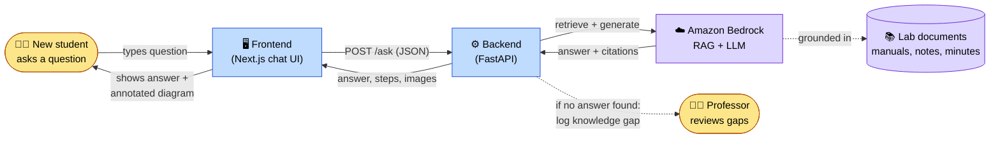
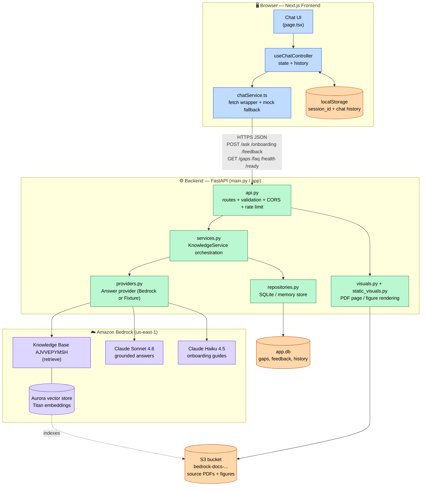
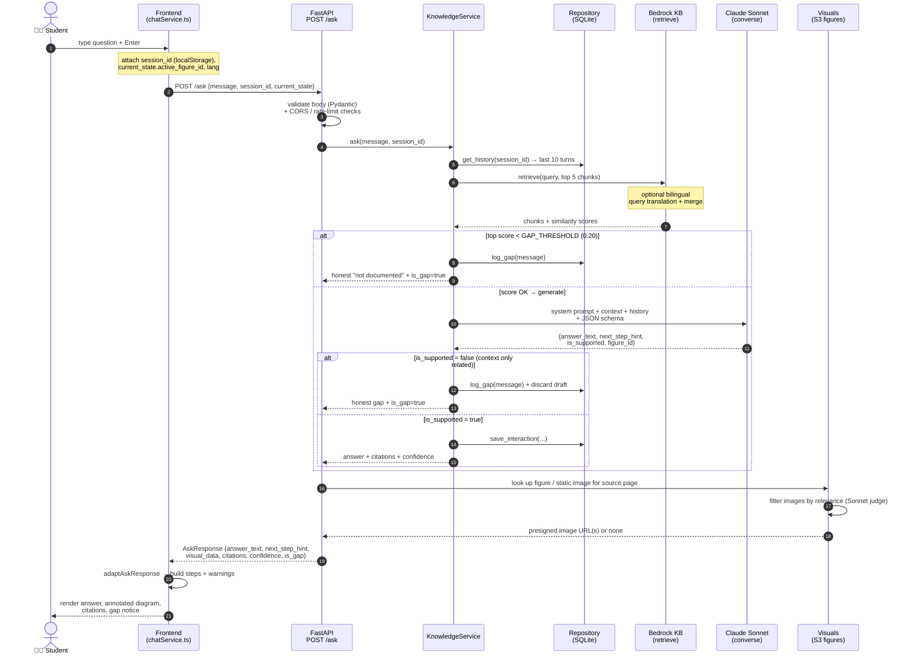
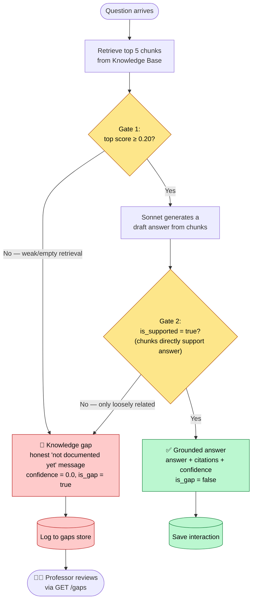
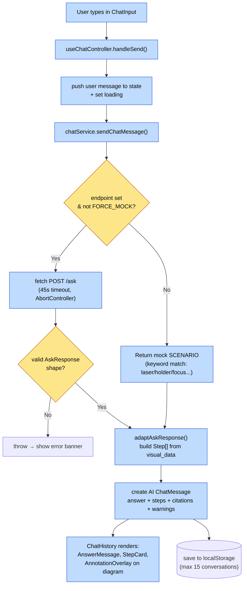
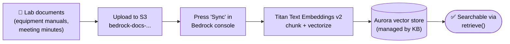
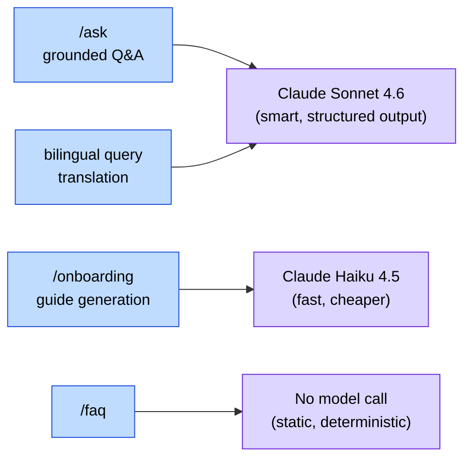

# Lab Tacit-Knowledge AI Agent — End-to-End Process Flow

> Presentation companion. Every diagram below is Mermaid. It renders in GitHub,
> VS Code (Mermaid preview), and most slide tools. Read top to bottom: each
> section zooms in one level deeper.

---

## 1. The 30-second story (read this slide first)

A new lab student asks a question in plain Japanese or English. The system
answers **only** from the lab's own uploaded documents. If the documents don't
contain the answer, it refuses to guess — it says so honestly and logs the
question for a professor to fill in later.

That honest "I don't know, and I wrote it down for a human" behavior is the
**signature feature**. It is the governance / anti-hallucination story.



---

## 2. System components — who talks to whom

This is the architectural map. The frontend never touches AWS directly; the
backend is the only thing holding credentials and calling Bedrock.



**Key boundary:** the frontend speaks one simple JSON contract to the backend.
The backend owns all AWS credentials, the knowledge gap logic, and persistence.

---

## 3. The full `/ask` journey — detailed sequence

This is the heart of the system. Follow a single question from keystroke to
rendered answer.



---

## 4. Knowledge-gap detection — the governance gate (zoom in)

The whole credibility of the product lives here. There are **two gates** an
answer must pass; failing either one turns it into an honest, logged gap.



> Why two gates? The retrieval score alone is not trustworthy — an unrelated
> manual once scored higher than a correct match. So Sonnet itself must confirm
> the retrieved text *directly supports* the answer before it ships.

---

## 5. The API contract — one shape, every field always present

Frontend and backend were built in parallel against this fixed contract. Every
field always ships, even if a given frontend ignores some of them.

```mermaid
flowchart LR
    subgraph Req["Request → POST /ask"]
        direction TB
        r1["message (the question)"]
        r2["session_id (conversation key)"]
        r3["current_state.active_figure_id"]
        r4["lang (ja | en)"]
    end

    subgraph Res["Response ← AskResponse"]
        direction TB
        a1["answer_text — the answer or honest 'I don't know'"]
        a2["next_step_hint — suggested follow-up action"]
        a3["visual_data — figure_id, highlight_item,<br/>static_images, source page, caption"]
        a4["citations[] — source doc + snippet"]
        a5["confidence — retrieval score (0.0 on gap)"]
        a6["is_gap — true = undocumented, logged for prof"]
    end

    Req ==> Backend{{"FastAPI<br/>+ Bedrock"}} ==> Res

    classDef io fill:#e0e7ff,stroke:#4338ca,color:#000
    class r1,r2,r3,r4,a1,a2,a3,a4,a5,a6 io
```



Other endpoints share the same simple style:

| Endpoint | Method | Purpose |
|----------|--------|---------|
| `/ask` | POST | Main Q&A with citations, gap detection, visuals |
| `/onboarding` | POST | Role-tailored guide (routed to **Haiku**) |
| `/gaps` | GET | Professor's list of unanswered questions |
| `/faq` | GET | Static, deterministic FAQ (no model call) |
| `/feedback` | POST | Thumbs up/down on an answer |
| `/health` | GET | Liveness (no AWS call) |
| `/ready` | GET | DB + provider readiness (no paid AWS call) |

---

## 6. Frontend internals — how the chat UI handles a turn



Notable resilience details to mention on stage:
- **Mock fallback:** if no backend URL is configured, the UI still demos with
  built-in scenarios — useful when the network is unreliable on stage.
- **Session persistence:** `session_id` and the last 15 conversations live in
  `localStorage`, so history survives refreshes.
- **Timeout guard:** requests abort after 45s with a clean error message.

---

## 7. How documents get in — the ingestion side (one-time / offline)

The Q&A flow above assumes documents are already searchable. Here is how they
got there.



> Until **Sync** runs, retrieval returns nothing and every question correctly
> reports a knowledge gap — that is honest behavior, not a bug.

---

## 8. Model routing — the right model for each job



---

## Speaker cheat-sheet

- **One sentence:** "It answers lab questions only from the lab's own documents,
  and honestly flags and logs anything it can't answer for a professor."
- **The differentiator:** knowledge-gap detection with two gates (retrieval
  score + Sonnet's `is_supported` check). Demos in seconds.
- **Trust model:** frontend holds no secrets; backend owns Bedrock, persistence,
  and the gap logic. Static FAQ makes no model call at all.
- **Resilience:** mock-mode frontend, demo-fixture backend, timeouts, rate
  limits, and verified SQLite backups mean the demo survives a flaky stage.
- **Region gotcha:** everything is `us-east-1`. Sonnet is an inference profile.
```
